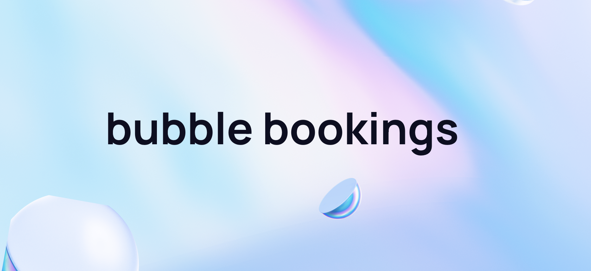

<a name="readme-top"></a>


<br />
<div align="center">
  <a href="https://github.com/hnguy59/bubble-booking">
    
  </a>

  <p align="center">
    <span>
A brand that listens to what their customers really need

Bubble bookings makes tech easy for service professionals to use and understand. 

With the pace of technology, it’s important for smaller businesses to keep up. we’re on a mission to make tech accessible to everyone, starting with beauty and wellness.
    </span>
    <br />
    <a href="https://github.com/hnguy59/bubble-booking"><strong>Explore the docs »</strong></a>
    <br />
    <br />
    <a href="https://github.com/hnguy59/bubble-booking">View Demo</a>
    ·
    <a href="https://github.com/hnguy59/bubble-booking/issues">Report Bug</a>
    ·
    <a href="https://github.com/hnguy59/bubble-booking/issues">Request Feature</a>
  </p>
</div>


<!-- TABLE OF CONTENTS -->
<details>
  <summary>Table of Contents</summary>
  <ul>
    <li>
      <a href="#about-the-project">About The Project</a>
      <ul>
        <li><a href="#built-with">Built With</a></li>
      </ul>
    </li>
    <li>
      <a href="#getting-started">Getting Started</a>
      <ul>
        <li><a href="#prerequisites">Prerequisites</a></li>
        <li><a href="#installation">Installation</a></li>
      </ul>
    </li>
    <li><a href="#useful-links">Useful Links</a></li>
  </ul>
</details>


<!-- ABOUT THE PROJECT -->
## About The Project
Despite a 4% yoy client spend growth on hair, beauty & wellness services, the perfect booking system does not exist in this industry.

Major players fail to relate to their end user, leading to “improvements” that don’t speak to business owners, staff or customers of the market.

With drastic room to grow and a strong product-focused mindset, stay tuned to see where the bubble team fits. 


<p></p>
<p align="right">(<a href="#readme-top">back to top</a>)</p>


### Tech stack

Based on a [t3 Stack][t3-url]:
- Framework - [Next.js][Next-url]
- Authentication - [NextAuth.js][NextAuth-url]
- Database toolkit - [Prisma][Prisma-url]
- Styling - [Tailwind CSS][Tailwind-url]
- Type safety - [tRPC][tRPC-url]
- Host - [Vercel][Vercel-url]
- Database Host - [Neon][neon-url]
- Icons - [Material Icons][MaterialIcons-url]

<p align="right">(<a href="#readme-top">back to top</a>)</p>


<!-- GETTING STARTED -->
## Getting Started

### Prerequisites

😎 be cool 😎

### Installation

1. Clone the repo
    ```sh
    git clone https://github.com/hnguy59/bubble-booking.git
    ```
2. Fill out the `.env` variables (an example can be found in `.env.example`)
3. Install NPM packages
    ```sh
    yarn install
    ```
4. Run on your local
   ```sh
   yarn dev
   ```
5. Shout Henry a bbt 🧋

<p align="right">(<a href="#readme-top">back to top</a>)</p>


<!-- USAGE EXAMPLES -->
## Usage

Use this space to show useful examples of how a project can be used. Additional screenshots, code examples and demos work well in this space. You may also link to more resources.

_For more examples, please refer to the [Documentation](https://example.com)_

<p align="right">(<a href="#readme-top">back to top</a>)</p>


<!-- GETTING STARTED -->
## Useful Links
- TODO [Website]
- [Trello](https://trello.com/w/customerpainpointresearch/home)
- [ClickUp](https://app.clickup.com/9003210068/home)


<!-- MARKDOWN LINKS & IMAGES -->
<!-- https://www.markdownguide.org/basic-syntax/#reference-style-links -->
[linkedin-shield]: https://img.shields.io/badge/-LinkedIn-black.svg?style=for-the-badge&logo=linkedin&colorB=555
[linkedin-url]: https://linkedin.com/in/linkedin_username

<!-- FE -->
[t3-url]: https://create.t3.gg/
[Next-url]: https://nextjs.org/
[Tailwind-url]: https://tailwindcss.com/
[NextAuth-url]: https://next-auth.js.org
[Prisma-url]: https://prisma.io
[tRPC-url]: https://trpc.io
[MaterialIcons-url]: https://mui.com/material-ui/material-icons/

<!-- BE/INFRA -->
[vercel-url]: https://vercel.com/
[postgresql-url]: https://www.postgresql.org/
[neon-url]: https://neon.tech/